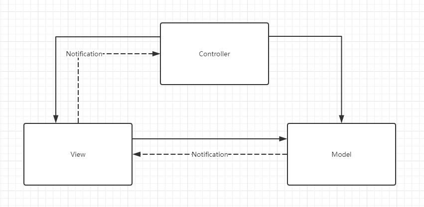

# egret-puremvc
## add puremvc libs and create sample code.

* 思考1 关于Notification名称的定义
>原使用静态常量定义到各组件（facade、mediator、controller、model）内部，按照谁发送，谁定义原则。
但在ts中并没有静态常量，所以创建AppMsgConst.ts用来存储所有消息的静态常量。
避免消息定义中的不可避免的重复，所以统一在一个文件中定义。

* 思考2 关于目录结构定义
>关于MVC项目的目录结构，一般会有两种结构

1. 先按照view、controller、model区分大模块，然后各自内部如果相对比较庞大可以在各自内部分
子文件夹来区别，如view下根据业务逻辑分为login、hall、game，来包含各自不同mediator。

2. 根据业务逻辑先区分login、 hall、game，然后把对应业务逻辑的MVC组建一并放入该文件夹中。
这样更易于阅读，但是对于模块化开发则容易产生干扰。

>总结：
>* 一般在各业务模块较小且各依赖较小时，采用第一种方式。多用于web应用及app开发，或者小型游戏。
>* 而对于业务模块大且复杂的游戏及应用，应优先考虑第二种方式来组织代码。由于PureMVC提供了多核版本，
对于更为复杂的产品，则可根据需求，划分为多个Facade组织下的相互独立的MVC模块。
>* 虽然第一种方式同样也适应于流水线式的开发，但是更多倾向于web应用那种可以清晰划分出各自具体功能
的产品。游戏产品更多的更自由的产品设计和更多快速的需求变更，所以业务模块的划分能更高效的实施
迭代开发。

* Command、Mediator、Model、内官方建议处理的Notification保持在最多4、5个。如果过多则需要拆分。

* 思考3 如何兼容eui初始化时序问题
>初始化Facade，初始化主ui--注册Mediator。初始化Command。初始化Proxy。 
现在假定app不进行模块化的分离，则应用内保持所有数据与逻辑。这样如果单个游戏过于复杂，则会出现过多的Command
来控制，而Command的分类则过于复杂及耦合。

* MVC各模块的调用及消息传递

>MVP则是取消了View直接引用Model，需要通过P(Presenter)-即Controller进行消息转发。
